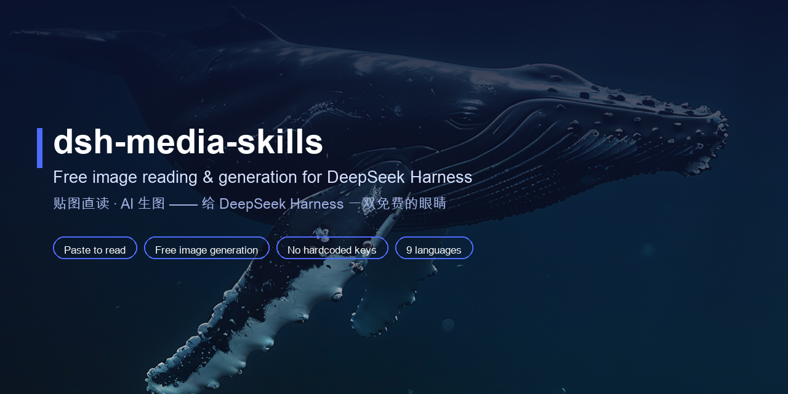

<div align="center">



<br>

# 🎨 dsh-media-skills

### *Вставляйте картинки прямо в чат — бесплатная модель зрения, чтение и генерация изображений.*

[](../../LICENSE)
[](https://python.org)
[](https://github.com/topics/dsh-plugin)

<br>

Подарите [DeepSeek Harness](https://github.com/deepseek-ai/deepseek-harness) «глаза» и «кисть» —
два бесплатных навыка, бесплатную модель зрения и вставку картинок, без зашитых ключей.

[Возможности](#-возможности) · [Быстрый старт](#-быстрый-старт) · [Использование](#-использование) · [Настройка зрения](../SETUP_VISION.md)

[**English**](../../README.md) · [**简体中文**](README_ZH.md) · [**繁體中文**](README_ZH_TW.md) · [**日本語**](README_JA.md) · [**한국어**](README_KO.md) · [**Español**](README_ES.md) · [**Deutsch**](README_DE.md) · [**Português**](README_PT.md) · [**Русский**](README_RU.md)

</div>

---

## ✨ Возможности

| Возможность | Что делает | Модель | Цена |
|---|---|---|---|
| 🖼️ Чтение вставленных картинок | В **текстовых** сессиях (например deepseek-v4-pro) в строке ввода появляется кнопка «Добавить изображение» (иконка изображения); вставленные картинки модель зрения автоматически превращает в текстовое описание для текущей модели | Zhipu GLM-4V-Flash | Бесплатно |
| 🧠 Маршрут модели зрения | После установки **автоматически** добавляет «智譜 GLM-4V-Flash（視覚）」 в селектор моделей — выбирайте её в новом диалоге и обсуждайте изображения | Zhipu GLM-4V-Flash | Бесплатно |
| 👁️ `vision-review` | Анализ / распознавание / описание изображений и скриншотов; поиск визуальных багов интерфейса (наложения, выход за границы, смещения); поиск водяных знаков и логотипов; перевод картинки в текст. Цепочка движков: GLM-4V-Flash → DeepSeek-V4-Flash-Vision-Exp (тот же ключ, что у агента, опционально платно) → SenseNova / SiliconFlow / Gemini | GLM-4V-Flash＋DeepSeek-Vision-Exp＋SenseNova＋Gemini | Бесплатно (DeepSeek опционально платно) |
| 🎨 `media-tools` | Генерация картинок, иллюстраций, аватаров, фонов и баннеров | SiliconFlow Kolors | Бесплатно, без водяных знаков |

> ⚠️ Честное замечание: чтение вставленных картинок — это возможность **ядра** DeepSeek Harness (логика приёма изображений в `api-proxy`). Этот бандл даёт **маршрут модели + навыки**; модель зрения работает на любой сборке DSH, но автописание требует сборки с этой поддержкой ядра. Как проверить: FAQ Q1.

## ⚡ Быстрый старт

1. Установите бандл:

   ```sh
   dsh plugin --profile <name> add github:MJorgin/dsh-media-skills
   ```

2. **Сначала бесплатно получите ключ**: зарегистрируйтесь на [open.bigmodel.cn](https://open.bigmodel.cn) → **API Keys** (glm-4v-flash бесплатен). Для генерации создайте ещё один на [siliconflow.cn](https://siliconflow.cn) (Kolors бесплатен). Затем укажите — веб-интерфейс (**Настройки → Модели** → поле **API Key** у провайдера zhipu-vision) или файл учётных данных:

   ```sh
   # ~/.dsh/.credentials.yaml (chmod 600)
   GLM_API_KEY: <ваш ключ>
   ```

3. **Полностью перезапустите** `dsh web` и жёстко обновите страницу (`Cmd+Shift+R`).

4. Проверьте: в селекторе моделей появилась **智譜 GLM-4V-Flash（視覚）**. Если ваша сборка поддерживает вставку картинок, в строке ввода появится кнопка 🖼️ **«Добавить изображение»** — вставьте картинку в любой сессии, и она придёт как текстовое описание.

Полное руководство, принцип работы и решение проблем: **[../SETUP_VISION.md](../SETUP_VISION.md)**

## 🔑 Ключи

Ключи **никогда не хранятся в этом репозитории**. Скрипты читают их по порядку: переменные окружения → `~/.dsh/secrets/media-tools.env` → `~/.codex/secrets/media-tools.env` (устаревший запасной вариант). Маршрут модели зрения читает `GLM_API_KEY` из хранилища учётных данных DSH.

Где получить (оба бесплатны): Zhipu — [open.bigmodel.cn](https://open.bigmodel.cn) → API Keys (glm-4v-flash). SiliconFlow — [siliconflow.cn](https://siliconflow.cn) → API Keys (Kolors).

```sh
# ~/.dsh/secrets/media-tools.env (chmod 600, одна пара KEY=value в строке)
GLM_API_KEY=...
SILICONFLOW_API_KEY=...
```

## 🚀 Использование

Три способа читать изображения:

| Способ | Как | Когда |
|---|---|---|
| **A. Вставить напрямую (рекомендуется)** | В любой сессии нажмите 🖼️ / перетащите / вставьте картинку и отправьте | Повседневные вопросы про картинки — без сохранения файлов и смены модели |
| **B. Сессия с моделью зрения** | Новый диалог, выберите 智譜 GLM-4V-Flash（視覚）, вставляйте картинки и общайтесь | Многошаговые диалоги про изображения, нативный `read_image` |
| **C. Файлы + навык** | Положите картинку в рабочую папку и скажите «прочитай это изображение через vision-review» | Пакетная проверка, скриптованные сценарии |

Язык описания следует за языком вашего сообщения (китайское сообщение → китайское описание; английское → английское; без текста → китайский).

Просто скажите:

- «Посмотри на эту картинку / проверь этот скриншот на визуальные баги» → `vision-review`
- «Сгенерируй изображение …» → `media-tools`

## 🗺️ Структура

```
dsh-media-skills/
├── package.json           # манифест dsh.bundle
├── cordis.patch.yml       # слой плагина
├── index.js               # регистрирует навыки + создаёт маршрут zhipu-vision
├── skills/
│   ├── vision-review/     # чтение изображений
│   └── media-tools/       # генерация изображений
├── docs/
│   ├── SETUP_VISION.md    # руководство по зрению (китайский)
│   ├── SETUP_VISION_EN.md # detailed setup guide (English)
│   └── lang/              # README на других языках
├── scripts/make-banner.py # пересоздаёт docs/social-preview.png
└── docs/social-preview.png
```

## 🤝 Присоединяйтесь к экосистеме плагинов DSH

Предварительная версия DeepSeek Harness для разработчиков всё ещё находится на стадии тестирования для разработчиков Harness; основные плагины и базовые API продолжат развиваться. Мы ждём совместного исследования верхних пределов интеллекта с разработчиками по всему миру — на открытой, переиспользуемой и компонуемой инфраструктуре с открытым исходным кодом.

- [Тема dsh-plugin](https://github.com/topics/dsh-plugin)
- [Быстрый старт](https://deepseek-harness.github.io/deepseek-harness/guide/quickstart)
- [Репозиторий DeepSeek Harness](https://github.com/deepseek-ai/deepseek-harness)

> Добавьте этому репозиторию тему [`dsh-plugin`](https://github.com/topics/dsh-plugin), чтобы его было проще найти.

## 📄 Лицензия

[MIT](../../LICENSE)
