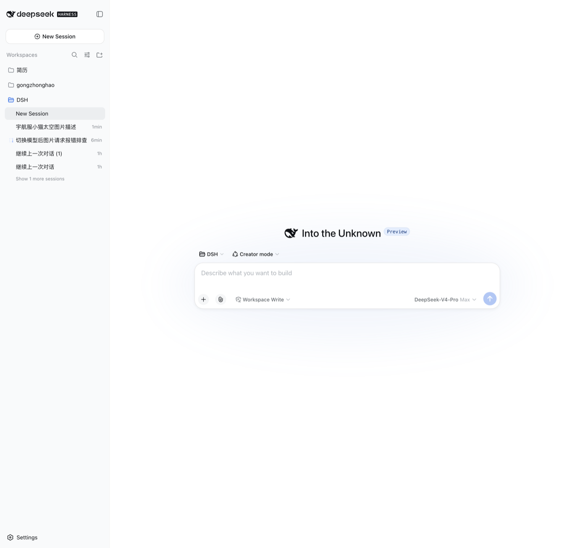
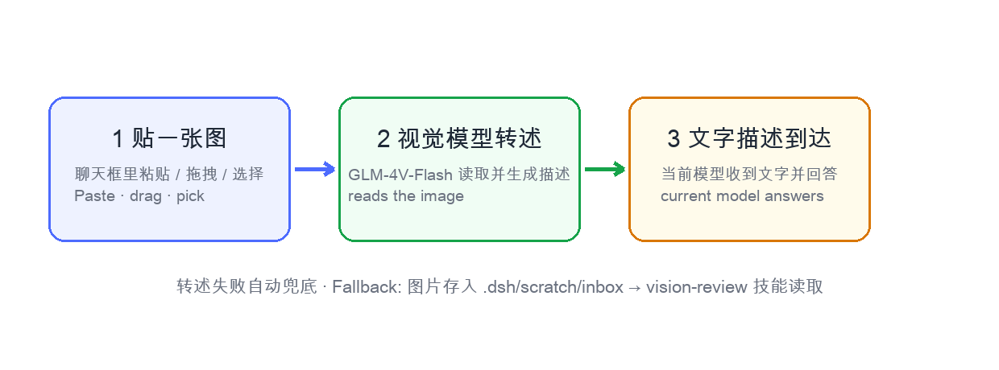
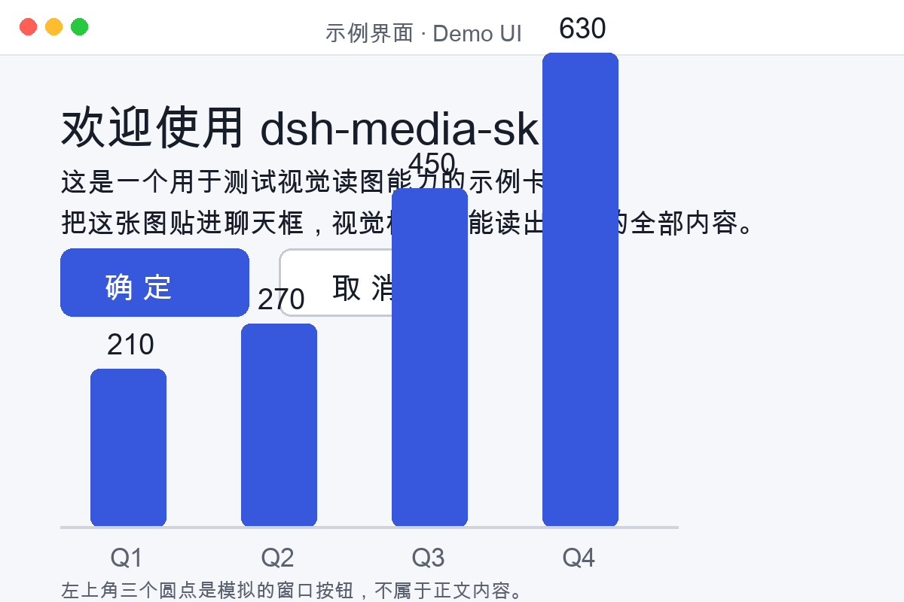

<div align="center">


<br>

# 🎨 dsh-media-skills

### *把图片直接贴进聊天框 —— DeepSeek Harness 的免费视觉模型、读图与生图 Skill*

[](../../LICENSE)
[](https://python.org)
[](https://github.com/topics/dsh-plugin)

<br>

给 [DeepSeek Harness](https://github.com/deepseek-ai/deepseek-harness) 装上真正的「眼睛」：在聊天框里贴一张图——
即使当前是纯文本模型——图片就会被自动读取、转述并回答。全程无 Key 硬编码。

[贴图直读](#-贴图直读) · [快速开始](#-快速开始) · [使用方式](#-使用方式) · [视觉模型详细配置](../SETUP_VISION.md) · [本体补丁说明](../HARNESS_PATCH.md)

[**English**](../../README.md) · [**简体中文**](README_ZH.md) · [**繁體中文**](README_ZH_TW.md) · [**日本語**](README_JA.md) · [**한국어**](README_KO.md) · [**Español**](README_ES.md) · [**Deutsch**](README_DE.md) · [**Português**](README_PT.md) · [**Русский**](README_RU.md)

</div>

---

## 📸 贴图直读

**核心能力。** 在任意会话——包括 deepseek-v4-pro 这类纯文本模型的会话——粘贴、拖拽或点选一张图片直接发送。免费的视觉模型（智谱 GLM-4V-Flash）会读取图片并把它转述成文字描述，交给你的当前模型理解。不用存文件，不用切会话。



*上：贴进去的图片变成了文字描述（「已由视觉模型读取」），模型照常回答。左下角：打开图片选择器的回形针按钮。*



> ⚠️ 诚实说明：「贴图自动转述」的管道属于 DeepSeek Harness **本体**（`api-proxy` 的图片准入逻辑，见 [../HARNESS_PATCH.md](../HARNESS_PATCH.md)）。本 bundle 负责**模型配置 + 读图/生图技能**；任何 DSH 版本装上后视觉模型都可用，但贴图直读需要你的 DSH 本体包含对应支持——判断方法见 [../SETUP_VISION.md](../SETUP_VISION.md) 常见问题 Q1。

## ✨ 能力一览

| 能力 | 说明 | 模型 | 费用 |
|---|---|---|---|
| 📎 贴图自动转述 | **纯文本会话**的输入框会多出「添加图片」按钮（回形针）；贴图后由视觉模型自动转成文字描述发给当前模型 | 智谱 GLM-4V-Flash | 免费 |
| 🧠 视觉模型路由 | 安装后**自动**在模型选择器里写入「智谱 GLM-4V-Flash（视觉）」，新会话选它即可直接看图对话 | 智谱 GLM-4V-Flash | 免费 |
| 👁️ `vision-review` | 分析 / 识别 / 描述图片与截图；找界面视觉 bug（重叠、溢出、错位）；检测水印 Logo；图片转文字 | 智谱 GLM-4V-Flash | 免费 |
| 🎨 `media-tools` | 生成图片、插画、头像、背景、banner | SiliconFlow Kolors | 免费、无水印 |

## ⚡ 快速开始

1. 安装 bundle：

   ```sh
   dsh plugin --profile <name> add github:akqwpeter-prog/dsh-media-skills
   ```

2. **先去免费申请 Key**：注册/登录 [open.bigmodel.cn](https://open.bigmodel.cn) → 「API Keys」（glm-4v-flash 免费，无需付费）；要生图再顺便到 [siliconflow.cn](https://siliconflow.cn) 创建一个（Kolors 免费）。然后填入——Web 界面（**设置 → 模型** → 找到 zhipu-vision 提供方的 **API Key 栏**）或凭据文件里填：

   ```sh
   # ~/.dsh/.credentials.yaml（chmod 600）
   GLM_API_KEY: <你的智谱 Key>
   ```

3. **彻底重启** `dsh web`，然后 `Cmd+Shift+R` 强刷页面。

4. 验证：模型选择器出现 **「智谱 GLM-4V-Flash（视觉）」**；若你的 DSH 版本支持贴图转述，输入框左下角还会出现 **📎「添加图片」按钮**。任意会话贴一张图——它会以文字描述的形式到达。

完整步骤、工作原理与排错：**[../SETUP_VISION.md](../SETUP_VISION.md)**

## 🔑 密钥

Key **永不写进本仓库**。技能脚本按顺序读取：环境变量 → `~/.dsh/secrets/media-tools.env` → `~/.codex/secrets/media-tools.env`（兼容回退）；视觉模型路由从 DSH 凭据库读取 `GLM_API_KEY`。

Key 获取（都免费）：智谱 [open.bigmodel.cn](https://open.bigmodel.cn) → API Keys（glm-4v-flash）；SiliconFlow [siliconflow.cn](https://siliconflow.cn) → API 密钥（Kolors）。

```sh
# ~/.dsh/secrets/media-tools.env （chmod 600，每行 KEY=value）
GLM_API_KEY=...
SILICONFLOW_API_KEY=...
```

## 🚀 使用方式

三种读图方式：

| 方式 | 怎么用 | 适用场景 |
|---|---|---|
| **A. 直接贴图（推荐）** | 任意会话点回形针选图 / 拖拽 / 粘贴，直接发送 | 日常看图，不用切会话、不用存文件 |
| **B. 视觉模型会话** | 新开对话，模型选「智谱 GLM-4V-Flash（视觉）」，贴图对话 | 多轮围绕图片对话、原生读图（`read_image`） |
| **C. 文件 + 技能** | 把图放到工作区，说「用 vision-review 读一下这张图」 | 批量检查、脚本化处理 |

转述语言自动跟随你发消息的语言（中文消息出中文描述、英文消息出英文描述；没打字默认中文）。

另外直接说：

- 「看看这张图 / 检查这个截图有没有视觉 bug」→ 走 `vision-review`
- 「给我生成一张 XX 的图」→ 走 `media-tools`

## 🎁 示例

开箱即用的示例素材——6 张 AI 生成图（附提示词）+ 一张专门构造的读图测试卡（标题、按钮、柱状图数值，用于检验读图准确度）：

  

→ [examples/README.md](../../examples/README.md)

## 🗺️ 目录结构

```
dsh-media-skills/
├── package.json           # dsh.bundle 清单
├── cordis.patch.yml       # 插件层
├── index.js               # 注册技能 + 自动写入 zhipu-vision 模型路由
├── skills/
│   ├── vision-review/     # 读图
│   └── media-tools/       # 生图
├── examples/              # 示例图片 + 读图测试卡
├── docs/
│   ├── screenshots/       # 演示截图与原理图
│   ├── SETUP_VISION.md    # 视觉模型详细配置指南（中文）
│   ├── SETUP_VISION_EN.md # detailed setup guide (English)
│   ├── HARNESS_PATCH.md   # 本体补丁说明（中文）
│   ├── HARNESS_PATCH_EN.md# core patch notes (English)
│   └── lang/              # 9 种语言的 README
├── scripts/make-banner.py # 复现 docs/social-preview.png
└── docs/social-preview.png
```

## 🤝 加入 DSH 插件生态

DeepSeek Harness 开发者预览版仍处于面向 Harness 开发者的测试阶段，核心插件和基础 API 将持续迭代。我们期待与全球开发者一起，在开源、开放、可复用、可组合的基础设施之上，共同探索智能上限。

- [dsh-plugin 插件话题](https://github.com/topics/dsh-plugin)
- [快速上手](https://deepseek-harness.github.io/deepseek-harness/guide/quickstart)
- [DeepSeek Harness 仓库](https://github.com/deepseek-ai/deepseek-harness)

> 给本仓库打上 [`dsh-plugin`](https://github.com/topics/dsh-plugin) topic，方便被发现。

## 📄 License

[MIT](../../LICENSE)
